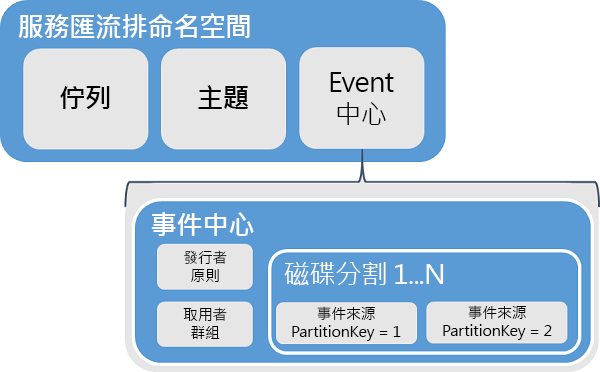
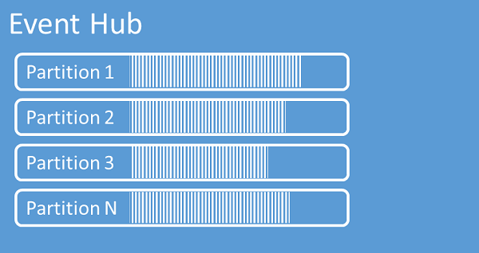
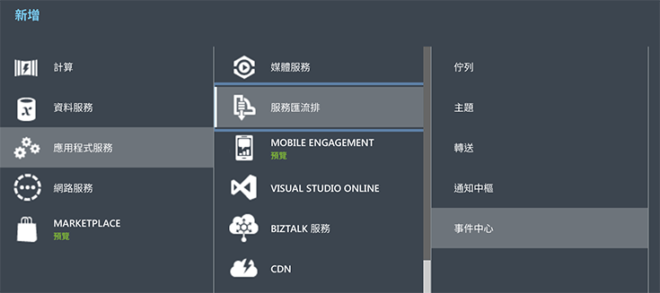
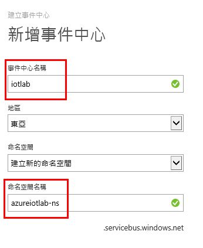
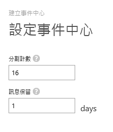
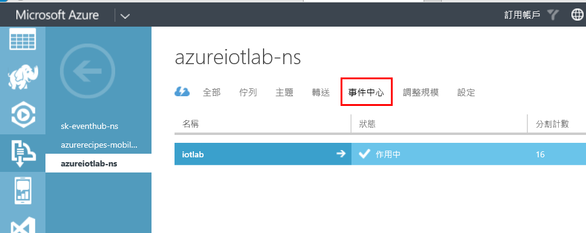
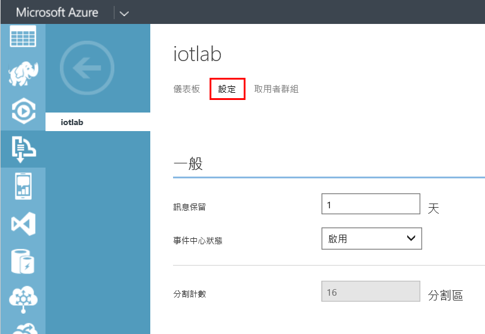
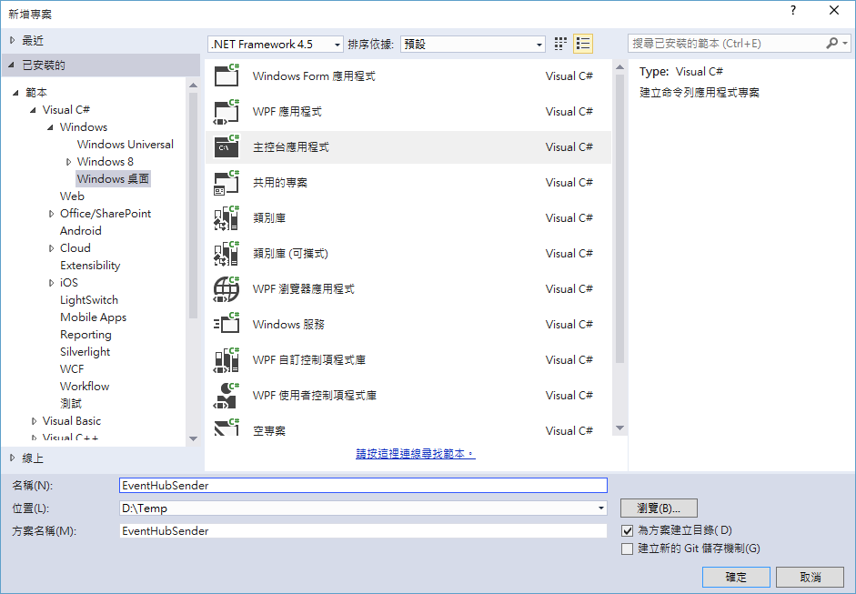
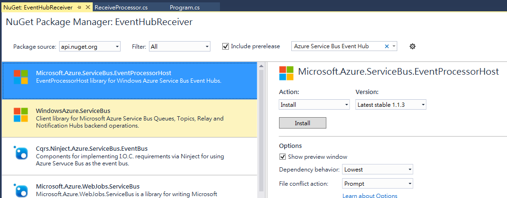
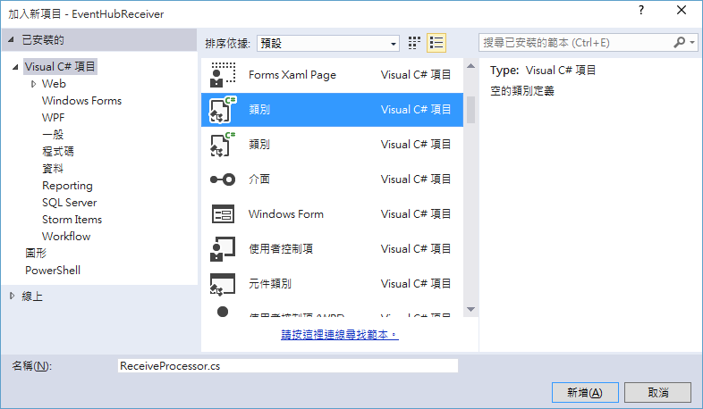

# Hands on Lab 1 - 使用 Azure Event Hubs #

操作時間：**30 分鐘**

事前準備：**擁有 Microsoft Azure 的訂閱帳戶並且能夠開通服務**。


# 1. Azure Event Hubs #

想像一種 IoT 情境 -- 你佈建了很多感測器，而它們不斷傳送大量的資料出來，如果讓這些感測器直接將資料寫入儲存體，I/O 寫入的速度可能追不上資料產生的速度，Event Hubs 就是為了能在短時間處理大量資料（如：每秒數百萬計）的佇列（queue）服務，它提供簡單的讀寫操作，而且通用的網路通訊協定（HTTP、AMQP），讓感測器可以很快地將資料先送到 Event Hubs 中（而且還不限前端 IoT 裝置使用何種技術平台），然後在時效之前將這些資料取出寫進（永久）儲存體中，這可以幫助開發人員節省力氣處理資料頻寬的問題。


## Event Hubs 的技術 ##



Event Hubs 是 [Azure Service Bus](http://azure.microsoft.com/zh-tw/services/service-bus/)（服務匯流排）中的一個特殊的佇列服務，連線與身份驗證的部份與 Service Bus 其它的服務一致，但是佇列結構有些不同，在 Event Hubs 中有**分割 (partition)** 的概念，這與 Event Hubs 能處理資料的頻寬有關，愈多的分割區就能提供更高的資料處理頻寬。你可以在 Event Hubs 中建立 8 ~ 32 個分割。



# 2. 建立 Event Hubs 服務

所需時間: **5 分鐘**

1.  在 [Microsoft Azure 的管理後台](https://manage.windowsazure.com/)，點擊左下角的_「+ 新增」_，選擇_「應用程式服務」_ » _「服務匯流排」_ » _「事件中心」_ ，選擇**自訂建立**。

    

2.  第一步，輸入 **事件中心名稱**，這個是 Event Hubs 的名字，之後使用程式介接時會用到這個名稱；資料中心的地區選擇 **東亞**，然後建立一個新的命名空間，這個是 Azure 服務匯流排（Service Bus）的名稱，必須取一個全球唯一的名稱，欄位後方會顯示該名稱是否可用。（Event Hubs 是服務匯流排裡的一個服務，所以服務的 URL 位址是以服務匯流排的 URL 為準）
    
    

3.  接著按下一步，設定 Event Hubs 的分割（partition）以及訊息要保留在 Event Hubs 裡多久，這裡我們設定_分割_為 **16**，_訊息保留_ **1** 天。

    


4.  最後，按下右下角的勾勾按鈕，完成建立。

# 3. 設定 Event Hubs 的存取原則

所需時間: **5 分鐘**

為了讓程式能接上 Event Hubs 來_傳送_或_接收_訊息，我們必須設定存取原則，讓程式使用不同的金鑰來傳送或接收（或是同時能傳也能收），做到權限的區分。

1.  在 [Microsoft Azure 的管理後台](https://manage.windowsazure.com/)，到剛才建立的服務匯流排中，切換到**事件中心**的頁面。

    

2.  進入建立好的 Event Hubs，切換到**設定**的頁面，你也可以在這頁修改訊息保留的時間。

    

3.  在 Event Hubs 的**設定**頁面下方的_「共用存取原則」_，新增兩個傳送訊息的原則，一個名稱為 **SendPolicy**，權限選擇**傳送**；另一個名稱為 **RecvPolicy**，權限選擇**接聽**。

	

4.  最後按下下方工作列的**儲存**按鈕，確定將新增的存取原則儲存。如果設定正確，你會在同一個頁面最下方看到_「共用存取金鑰產生器」_區域，這裡就可以取得不同原則的金鑰。


	


# 4. 傳送訊息到 Event Hubs

所需時間: **10 分鐘**

1.  開啟 Visual Studio，按下_「新增專案」_，從範本中選擇 _Visual C#_ » _Windows_ » _Windows 桌面_ ，建立一個 **主控台應用程式（Console Application）**，名稱可以取作 **EventHubSender**。

    

2.  接下來準備安裝 Azure Service Bus SDK 來存取 Event Hubs，在專案上按右鍵，選擇**管理 NuGet 套件...**。

    

3.  在 NuGet 套件管理員中，搜尋 _Azure Service Bus_ 找到官方發行的 SDK 後安裝。

    

4.  將下列程式碼貼到 **Program.cs** 檔案中，貼上後，記得將 ```eventHubName``` 的數值修改為您前面設定的 Event Hub 名稱（不是 Service Bus 的名稱），而 ```connectionString``` 修改為前述設定存取原則時，傳送訊息原則的連接字串：

	```csharp
	using System;
	using System.Text;
	using System.Threading.Tasks;
	using Microsoft.ServiceBus.Messaging;

	namespace EventHubSender
	{
	  class Program
	  {
	    static string eventHubName = "你的事件中樞名稱";
	    static string connectionString = "你的連接字串";

	    static void Main(string[] args)
	    {
	      Console.WriteLine("按下 Ctrl-C 來停止傳送訊息");
	      Console.WriteLine("按下 Enter 鍵後開始傳送訊息");
	      Console.ReadLine();
	      SendingRandomMessages().Wait();
	    }

	    static async Task SendingRandomMessages()
	    {
	      var eventHubClient = EventHubClient.CreateFromConnectionString(connectionString, eventHubName);
	      var random = new Random();
	      while (true)
	      {
	        var guid = Guid.NewGuid().ToString();
	        var time = DateTime.Now.ToString();
	        var thermal = random.Next(195, 265) / 10.0 ;
	        var humidity = random.Next(58, 82);
	        var message = "{\"id\":\""+guid+"\", \"thermal\":"+thermal+", \"humidity\":"+humidity+", \"time\":\""+time+"\"}";

	        try
	        {
	          Console.WriteLine("{0} > 傳送訊息:{1}", time, message);
	          await eventHubClient.SendAsync(new EventData(Encoding.UTF8.GetBytes(message)));
	        }
	        catch (Exception exception)
	        {
	          Console.ForegroundColor = ConsoleColor.Red;
	          Console.WriteLine("{0} > 例外狀況:{1}", time, exception.Message);
	          Console.ResetColor();
	        }

	        await Task.Delay(200);
	      }
	    }
	  }
	}
	```
5.  這個程式執行後，按下 Enter 就會開始不斷送出訊息（真正送訊息的是 ```await eventHubClient.SendAsync(new EventData(Encoding.UTF8.GetBytes(message)));``` 這一段），直到您按下 Ctrl+C 後才會停止送訊息到 Azure Event Hubs 上。

# 5. 從 Event Hubs 中取出訊息

所需時間: **10 分鐘**

1.  開啟 Visual Studio，按下_「新增專案」_，從範本中選擇 _Visual C#_ » _Windows_ » _Windows 桌面_ ，建立一個 **主控台應用程式（Console Application）**，名稱可以取作 **EventHubReceiver**。

    

2.  接下來準備安裝 Azure Service Bus SDK 來存取 Event Hubs，在專案上按右鍵，選擇**管理 NuGet 套件...**。

    

3.  在 NuGet 套件管理員中，搜尋 _Azure Service Bus Event Hub EventProcessorHost_ 找到官方發行的 SDK 後安裝。

    

4.  在專案中右鍵新增類別，名稱為 **ReceiveProcessor.cs**。

	

5.  將下列程式碼貼在 **ReceiveProcessor.cs** 檔案裡：

	```csharp
	using System;
	using System.Collections.Generic;
	using System.Diagnostics;
	using System.Text;
	using System.Threading.Tasks;
	using Microsoft.ServiceBus.Messaging;

	namespace EventHubReceiver
	{
	  class ReceiveProcessor : IEventProcessor
	  {
	    Stopwatch checkpointStopWatch;
	
	    async Task IEventProcessor.CloseAsync(PartitionContext context, CloseReason reason)
	    {
	      Console.WriteLine(string.Format("Processor Shuting Down.Partition '{0}', Reason:'{1}'.", context.Lease.PartitionId, reason.ToString()));
	      if (reason == CloseReason.Shutdown)
	      {
	        await context.CheckpointAsync();
	      }
	    }
	
	    Task IEventProcessor.OpenAsync(PartitionContext context)
	    {
	      Console.WriteLine(string.Format("SimpleEventProcessor initialize.Partition:'{0}', Offset:'{1}'", context.Lease.PartitionId, context.Lease.Offset));
	      this.checkpointStopWatch = new Stopwatch();
	      this.checkpointStopWatch.Start();
	      return Task.FromResult<object>(null);
	    }
	
	    async Task IEventProcessor.ProcessEventsAsync(PartitionContext context, IEnumerable<EventData> messages)
	    {
	      foreach (EventData eventData in messages)
	      {
	        string data = Encoding.UTF8.GetString(eventData.GetBytes());
	
	        Console.WriteLine(string.Format("Message received.Partition:'{0}', Data:'{1}'",
	            context.Lease.PartitionId, data));
	      }
	
	      //Call checkpoint every 5 minutes, so that worker can resume processing from the 5 minutes back if it restarts.
	      if (this.checkpointStopWatch.Elapsed > TimeSpan.FromMinutes(5))
	      {
	        await context.CheckpointAsync();
	        this.checkpointStopWatch.Restart();
	      }
	    }
	  }
	}
	```

6.  回到 **Program.cs**，將下列程式碼貼入，這裡除了要填入事件中樞的名稱之外，也要使用有讀取訊息原則的連接字串，還要填入一個 Azure 儲存體的帳號資料用來存放操作的記錄檔，所以要到 Azure 上建立一個儲存體帳戶再取得存取金鑰填入

	```csharp
	using System;
	using Microsoft.ServiceBus.Messaging;
	
	namespace EventHubReceiver
	{
	  class Program
	  {
	    static void Main(string[] args)
	    {
	      string eventHubConnectionString = "讀取原則的連接字串";
	      string eventHubName = "事件中樞名稱";
	      string storageAccountName = "儲存體帳戶名稱";
	      string storageAccountKey = "儲存體存取金鑰";
	      string storageConnectionString = string.Format("DefaultEndpointsProtocol=https;AccountName={0};AccountKey={1}",
	                  storageAccountName, storageAccountKey);
	
	      string eventProcessorHostName = Guid.NewGuid().ToString();
	      EventProcessorHost eventProcessorHost = new EventProcessorHost(eventProcessorHostName, eventHubName, EventHubConsumerGroup.DefaultGroupName, eventHubConnectionString, storageConnectionString);
	      eventProcessorHost.RegisterEventProcessorAsync<ReceiveProcessor>().Wait();
	
	      Console.WriteLine("Receiving.Press enter key to stop worker.");
	      Console.ReadLine();
	    }
	  }
	}
	```

7.  開始執行後，就可以看到這個程式會從 Event Hub 中取出訊息。