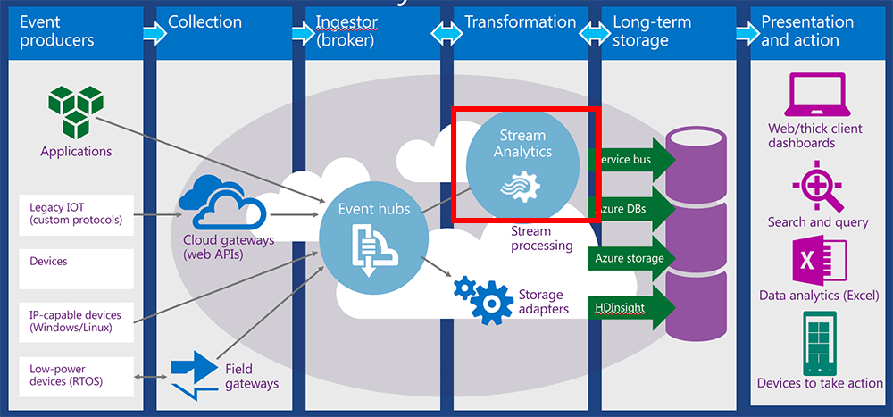
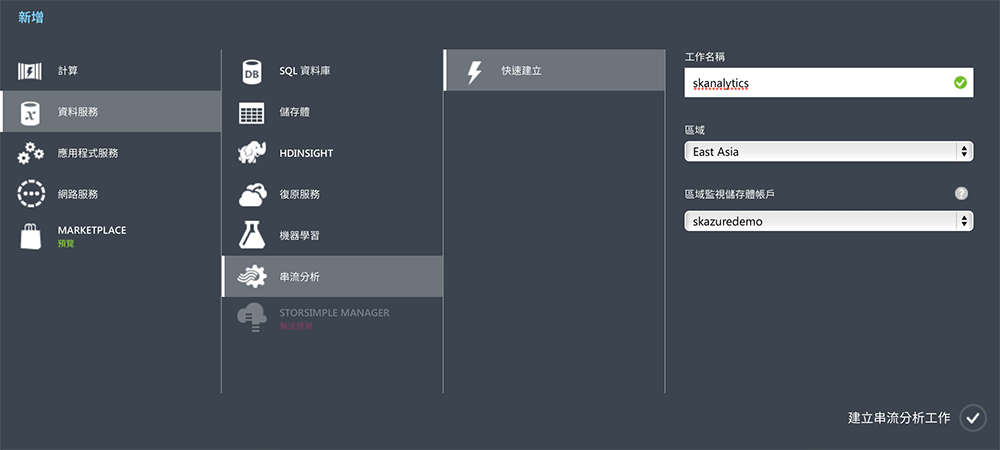
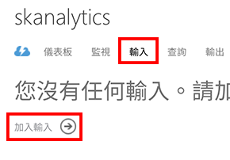
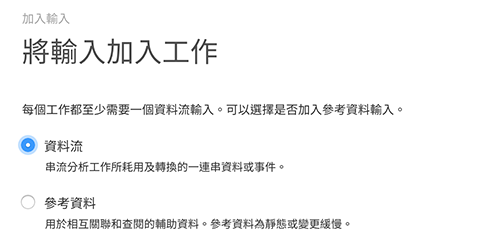
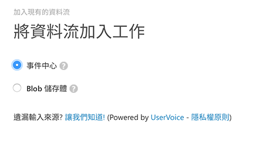
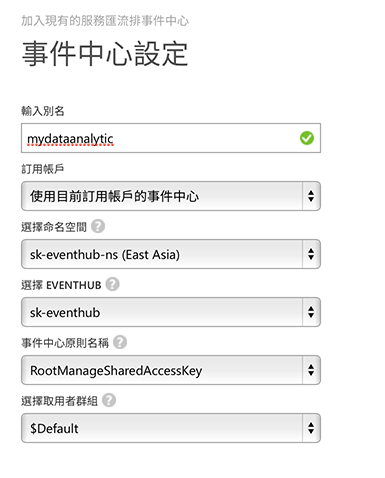
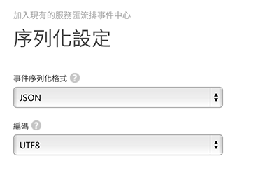
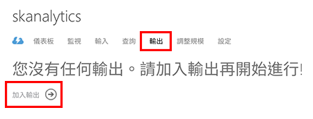
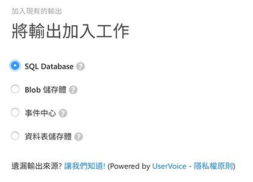
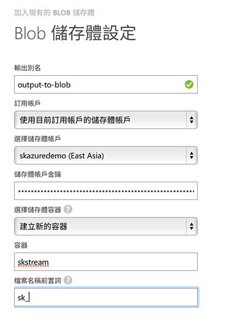

# Hands on Lab 2 - 使用 Azure Stream Analytics #

操作時間: **30 分鐘**

事前準備：

  1. **擁有 Microsoft Azure 的訂閱帳戶並且能夠開通服務**。
  2. 完成 [Hands-on Lab 1 - 使用 Azure Event Hubs](HOL1-EventHubs.md)


# 1. Azure Stream Analytics #

若希望在資料進 Event Hubs 時就即時地針對這些資料做處理（可能等不及寫入儲存），這時就能利用 Azure Stream Analytics （資料流分析）服務來完成。



# 2. 建立 Azure 資料流分析工作 #

所需時間: **5 分鐘**

1.  在 [Microsoft Azure 的管理後台](https://manage.windowsazure.com/)，點擊左下角的_「+ 新增」_，選擇_「資料服務」_ » _「串流分析」_ 就可以設定名稱、選擇資料中心並設定搭配的儲存體帳戶，就能快速建立一個 Azure 資料流分析的工作。

    

2.  建立好 Azure 資料流分析後，可以在管理頁面中的**輸入**頁籤加入要監控的資料來源。

    

3.  點擊**加入輸入**後會出現一個對話盒，這裡我們選擇加入**資料流（stream）**。

    
    
4.  下一步選擇資料流的來源，這裡因為我們選擇**事件中心（event hubs）**。

    

5.  接著是選擇要監控的 event hubs，以及這個分析工作的名稱，權限及取用者群組的部份就根據需求來設定。

    

6.  最後一步，為了讓 Azure 資料流分析認得傳入 event hub 的資料是什麼_格式_（目前支援 _Avro_、_CSV_ 及 _JSON_）及_字元編碼_，在建立前可以先做設定（事後再到管理頁面修改也可以）。

    

7.  這些設定完成後就建好了資料流分析工作。


# 3. 設定資料流輸出位置 #

所需時間: **3 分鐘**

1.  在開始設定分析工作之前，可以先設定好當分析工作結束後要將結果輸出到哪一個儲存環境，在 Azure Stream Analytics 的服務管理頁面，選擇**輸出**的頁籤開始建立輸出位置。

    

2.  輸出的位置可以選擇 _SQL 資料庫_、_BLOB 儲存體_、_事件中心 (Event Hubs)_ 以及 _Table 儲存體_。

    

3.  若選擇 _BLOB 儲存體_就再設定相關的資訊，最後再輸出資料格式以及字元編碼就可以完成建立。

    

# 4. 設定查詢工作及啟動 #

所需時間: **10 分鐘**

1.  Azure Stream Analytics 提供一種類似 SQL 查詢語法的方式讓你設定在資料流的分析工作中，在管理頁面中選擇**查詢**的頁籤就可以設定，然後用 ```INTO``` 子句將結果送到前面設定的輸出位置，用 ```FROM``` 設定資料來源（使用設定的別名）。所以設定的查詢語法可能會像是這樣：

	```sql
	SELECT
        *
	INTO
		myoutput
	FROM
		mydata
	WHERE
		thermal > 26
	```

2.  在 Azure Stream Analytics 的管理頁面下方工作列按下**開始**的按鈕便可以啟動資料流分析工作，而要停止時也是在相同的地方按下停止按鈕。而啟動工作後，如果進 Event Hub 的資料符合設定的查詢條件，就會根據設定將資料輸出到設定的位置。

3.  啟動在 Hands on Lab 1 的 **EventHubSender** 專案開始送出訊息，然後在設定的輸出儲存體中查看由串流分析所取出的內容。


## 參考資料

* [Azure 資料流分析簡介](http://azure.microsoft.com/zh-tw/documentation/articles/stream-analytics-introduction/)
* [開始使用 Azure 資料流分析](http://azure.microsoft.com/zh-tw/documentation/articles/stream-analytics-get-started/)
* [Azure 資料流分析查詢語言參考](https://msdn.microsoft.com/zh-tw/library/dn834998.aspx)
